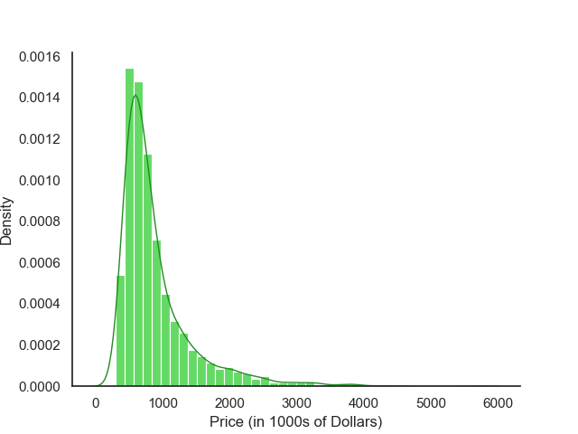

# SDSS Datathon 2025
## Table of Contents 📚
1. [Introduction](#1-introduction-)
2. [Dataset](#2-our-dataset-)
3. [Initial Findings](#3-exploratory-data-analysis-and-initial-findings-)
4. [Visualizations](#4-visualizations-)
5. [Our Model](#5-our-model-)
7. [Results](#6-results-)
6. [Discussion](#7-discussion-)

## 1. Introduction 💡
Real estate markets are constantly evolving, and are an interest of potential homeowners, investors, real-estate agents, and city planners. Property values are influenced by a variety of factors and grasping their relative importance is key to understanding future pricing trends. However, the market’s complexity can present significant challenges in making accurate predictions. Developing a reliable prediction model is essential for understanding these trends, enabling better decision-making for relevant parties.

In this project, we take a look at recent real estate trends in the city of Toronto. In considering the relationships between real estate prices and factors like location, amenities, etc. we seek to inform future predictions about the quality and pricing of housing in downtown Toronto. This information could contribute to more informed investment, home buying, selling, and city planning. The information uncovered in this investigation could also be relevant in highlighting discrepancies between housing prices and income in Toronto, thus informing the need for more affordable housing or rent control.

## 2. Our Dataset 👩‍💻
### 2.1 Description
This dataset is a simulated representation of the Toronto real estate market, designed to reflect condo sales prices listed on the Multiple Listing Service. It focuses specifically on Toronto’s downtown core, covering three wards as defined by the City of Toronto (Wards 10, 11, and 13). The data have been curated to closely resemble real-world trends and variable relationships, enabling meaningful analysis. Please see [here](https://drive.google.com/drive/u/0/folders/1Y1sOZAPeHhqiO_hwkCkz_H6BPT-WXZEU) for more information.

#### 2.1.1 Relevant Fields
* **id**: A unique 6-digit identifier for each building.
* **ward**: The ward number the building is located in.
    * W10 - Spadina-Fort York
    * W11 - University-Rosedale
    * W13 - Toronto Centre
* **beds**: The number of bedrooms units in the building have.
* **baths**: The number of bathrooms units in the building have.
* **size**: The range of square footage units in the building with the given number of beds and baths have.
* **building age**: The age (in years) of the building.
* **price**: The listing [purchase] price of a unit in the building in CAD.

### 2.2 License
This dataset was provided by the *Students in Data Science and Statistics* and is licensed under City of Toronto's Open Government License. For more information on license information, please visit City of Toronto's [website](https://www.toronto.ca/city-government/data-research-maps/open-data/open-data-licence/).

### 2.3 Preprocessing Steps
1. In our analysis, the most important factor we are considering is the **size** (square footage) of building units. We therefore removed all entries where size was *NA*.
2. Size was given in ranges of 500 square feet and as string values. We took the median value for each range and converted to integers.
    * e.g. "1500-1999 sqft" becomes 1749.
3. Some entries did not have prices provided. We removed those entries.
4. Of the entries that did provide prices, we divided all values by 1000 to increase readability.

After processing, we were left with 2928 entries.

### 2.4 Justification
Our dataset has 3042 entries of different residential buildings across three wards in Toronto (Spadina-Fort York, University-Rosedale, and Toronto Centre). Each entry includes information about building amenities, location, age, and price. The dataset can thus be used to examine how price varies according to such factors. Further study can be conducted by cross-referncing each building with more information about its ward's demographic, which can be found [here](https://www.toronto.ca/city-government/data-research-maps/neighbourhoods-communities/ward-profiles/).

## 3. Exploratory Data Analysis and Initial Findings 🔍
Ultimately, we are interested in studying the prices of real estate units across Toronto. Let's take a look at the price distribution of buildings in our data set.

We can use Python to compute some quick summary statistics:
```
# Load data
df = pd.read_csv("./cleaned_real_estate_data.csv")

# Summarize data 
prices = df['price (In 1000s)']
summary = prices.describe()
print(summary)

>>> count    2928.000000
>>> mean      894.598702
>>> std       560.099359
>>> min       298.000000
>>> 25%       551.000000
>>> 50%       717.500000
>>> 75%      1012.250000
>>> max      5688.000000
```
From this information, it seems the average property has a list price of $894k. However, it is important to observe that the range of our data is $5,390k. This is an *incredible* amount of variation, especially with regards to the IQR of $461.25k. Looking at our minimum and maximum values, it seems like our data may be right-skewed. To confirm this, we have to take a look at the distribution graphically.

<figure>
    
    <figcaption><strong>Fig. 1:</strong> Density histogram of price (in thousands of CAD).</figcaption>
</figure>

From this figure, we confirm that the price distribution is right-skewed. Moreover, we see that the majority of real estate properties have a price that falls within the range of $250,000 - $1,000,000. From this information, we can conclude that our previous sample mean may not be robust enough to reflect the actual mean property value.

We had previously obtained a median list price of $717k. Comparing this to the [2024's Q4 average condo sale price](https://trreb.ca/market-data/condo-market-report/) in Toronto, $689,198, we see that our median is a much closer approximation to this.

For some extra investigation, let's see if the distribution of prices varies across the 3 neighborhoods (wards) we examine.

<figure>
    
    <figcaption><strong>Fig. 2:</strong> Ward vs. price (in 1000s of CAD)</figcaption>
</figure>

It seems that real estate prices are distributed similarly across the three wards. University-Rosedale (on average) has the most expensive units, while Spadina-Fort York encompasses the unit with the highest list price. But overall, there is little discernable difference between them.

## 4. Visualizations 📊

## 5. Our Model ⚡️

## 6. Results ❗️

## 7. Discussion 🗣️
